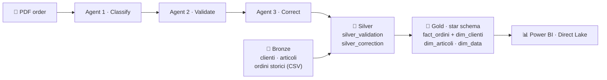

# ACME Order Management — from PDF orders to a Power BI dashboard

End-to-end pipeline that turns unstructured **PDF purchase orders** into clean, analytics-ready data.
A **multi-agent LLM pipeline** (Azure AI Foundry) extracts, validates and corrects each order; a
**Microsoft Fabric medallion architecture** (PySpark + Delta Lake) then models the data into a
**star schema** that powers a **Power BI** dashboard.

> **Design principle:** the LLM does only what *only* an LLM can do — reading free text.
> Business rules, joins, aggregations and data-quality checks are deterministic Python / PySpark.

---

## 🧭 End-to-end architecture



The agents are only **stage one**. The part most LLM demos skip — turning extracted orders into a
**governed, queryable data model** — is where this project spends most of its effort.

---

## 1 · Agentic extraction pipeline  (`/agents`)

Three GPT-4.1-mini agents orchestrated in Python:

| Agent | Role | Output |
|-------|------|--------|
| **1 — Classify** | Reads the PDF, returns structured JSON with a confidence score | `{ tipo, confidenza, righe… }` |
| **2 — Validate** | Checks customer, article codes, prices vs. price list, quantities | `VALID / WARNING / INVALID` |
| **3 — Correct** | Fixes only what is deducible; max 2 retries, else human escalation | `CORRECTED / manual` |

~€0.005 per order end-to-end, with automatic token/cost logging. Validated results land in the
Silver tables `silver_validation` and `silver_correction`.

---

## 2 · Data engineering on Microsoft Fabric  (`/fabric`)

Medallion architecture built in a Fabric Lakehouse with **PySpark + Delta**
(`fabric/notebooks/bronze_to_silver_to_gold.ipynb`):

- **🥉 Bronze** — raw ingestion: customer & product master data and historical ERP orders (CSV), plus the raw agent JSON.
- **🥈 Silver** — validated & corrected orders from the agents, kept only where status is `VALID`, resolved `WARNING`, or `CORRECTED`.
- **🥇 Gold** — a **star schema** ready for BI, written as Delta tables (plus optional service CSVs for file-based refresh).

### Data model (star schema)

| Table | Type | Grain | Key(s) | Highlights |
|-------|------|-------|--------|-----------|
| `fact_ordini` | Fact | one row per **order line** | `Riga_ID`, `Data_ID`, `Cliente_ID`, `Codice_Articolo` | measures: `Quantita`, `Prezzo_Unitario`, `Importo_Riga` |
| `dim_clienti` | Dimension | customer | `Cliente_ID` | company, VAT, city, province |
| `dim_articoli` | Dimension | product | `Codice_Articolo` | category, list price |
| `dim_data` | Dimension | date | `Data_ID` | year, quarter, month, `AnnoMese`, weekday |

### Data quality built into the model
- **Two sources, one fact table:** live *agentic* orders are unioned with *historical ERP* orders and de-duplicated, each tagged via `Origine_Dati` and `Pipeline`.
- **Price-drift detection:** on historical lines, `Scostamento_Prezzo_Pct` flags prices more than **5%** off the official list price.
- **Completeness flag:** `Dati_Incompleti` marks lines whose customer or product code couldn't be matched.
- **Column sanitisation** so field names are Delta / SQL-endpoint / DAX friendly and Direct Lake compatible.

---

## 3 · Data analysis in Power BI  (`/powerbi`)

The Gold star schema feeds a Power BI report over **Direct Lake**. Key findings on the demo dataset
(**81 orders · 19 customers · €381K · €4.7K avg order**):

- **Product mix —** *Utensili* is the top category at **€99K (26%)**, ahead of consumables (€84K) and electrical components (€77K).
- **Customer concentration —** the **top 5 customers = 46%** of revenue → a commercial-risk signal to monitor.
- **Seasonality —** recurring revenue peaks in **March and July**, useful for stock & capacity planning.
- **Governance —** auto-approval rate and average token cost per order are tracked as first-class measures.

> 📷 _Dashboard screenshots in `/powerbi/screenshots`._

---

## 🗂️ Repository structure

```
ACME-Order-Management-Simulator/
├── agents/                                   # Stage 1 — multi-agent LLM pipeline (Azure AI Foundry)
│   ├── src/                                  #   main.py + step_1/2/3, export, info/quote
│   ├── prompts/                              #   system prompts for agents 1-3
│   ├── data/                                 #   articoli.csv, clienti.csv, pdf_input/
│   ├── requirements.txt
│   ├── .env.example
│   └── README.md
├── fabric/
│   └── notebooks/
│       └── bronze_to_silver_to_gold.ipynb    # Stage 2 — PySpark medallion -> star schema
├── powerbi/
│   └── screenshots/                          # dashboard images
├── data/
│   └── sample/                               # sample Bronze files (Customers/, Products/)
├── docs/                                     # ARCHITECTURE.md, traccia_progetto.docx
├── README.md
├── .gitignore
└── LICENSE
```

## ▶️ Reproduce the data layer

1. In a **Microsoft Fabric** workspace, create a **Lakehouse** and upload the Bronze CSVs under `Files/Bronze/…`.
2. Run the agent stage (`/agents`) so the Silver tables `silver_validation` / `silver_correction` exist.
3. Import and run `fabric/notebooks/bronze_to_silver_to_gold.ipynb` — it writes the Gold Delta tables (`fact_ordini`, `dim_clienti`, `dim_articoli`, `dim_data`).
4. In **Power BI**, connect to the Lakehouse via **Direct Lake** and build the report.

## 🧰 Tech stack

`Python` · `Azure AI Foundry` · `GPT-4.1 mini` · **`PySpark`** · **`Delta Lake`** · **`Microsoft Fabric`** · **`Direct Lake`** · **dimensional modelling (star schema)** · **`Power BI`** · `DAX`

---

<sub>Part of my portfolio — see [github.com/FraFico](https://github.com/FraFico).</sub>
